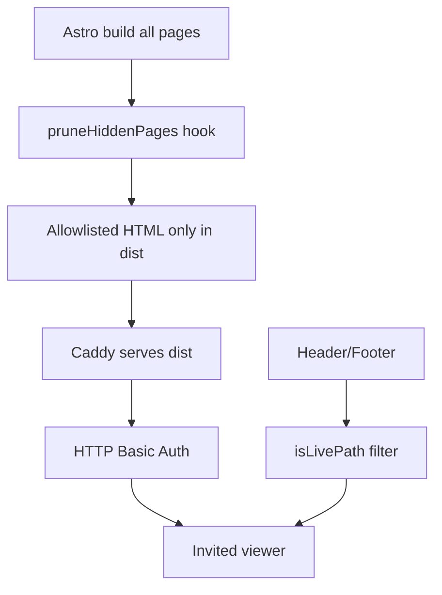

# Soft-launch visibility inventory

What is **online** vs **hidden** during the phased Railway launch. The allowlist
logic lives in [`launch.ts`](../launch.ts); this document is the human-readable
inventory of what invited viewers see after deploy.

**Mechanism:** when `LAUNCH_LIVE_ONLY` is `true`, Astro builds every page but
[`astro.config.mjs`](../../../astro.config.mjs) prunes hidden HTML from `dist/`.
Header and Footer drop links to non-allowlisted paths via `isLivePath()`. Docker
builds force `LAUNCH_LIVE_ONLY = true` regardless of git branch.

## Access layer

- **HTTP Basic Auth** on the whole deployment ([`Caddyfile`](../../../Caddyfile)) —
  credentials from `BASIC_AUTH_USER` / `BASIC_AUTH_HASH` in Railway.
- **Root redirect:** `/` → `/en/`.
- **Locales served:** `en`, `da`, `de`, `sv` (da/de/sv fall back to English where
  untranslated).
- **Search indexing:** only **English** pages are indexed site-wide; **`/compare/`**
  is indexed in all four locales ([`lang.ts`](../lang.ts)). Other locales are
  `noindex` and omitted from the sitemap when tagged.

## Global chrome

### Header ([`Header.astro`](../../../components/Header.astro))

| Area | Visible on soft-launch |
|------|------------------------|
| Utility bar | “Built in Denmark” status, **Helpcenter** (external), language switcher |
| Primary nav | **Products**, **Resources**, **Company** only |
| Hidden nav items | **Industries**, **Pricing** (no live destinations) |
| Products dropdown | **Modules** (4 live) + **Sensors** (6 featured + “All sensors” + **Compare sensors**) — **no Platform column** |
| Resources dropdown | **Case studies** only (Articles, Whitepapers hidden) |
| Company dropdown | **About**, **Careers**, **Contact** |
| Header actions | **Log in** (external RoomAlyzer), **Book a demo** CTA |

### Footer ([`Footer.astro`](../../../components/Footer.astro))

| Column | Visible links |
|--------|----------------|
| Product | Modules, Sensors |
| Evaluate | Compare |
| Resources | Case studies, Product sheets |
| Company | About, Careers, Partners, Press, Events, Contact |
| Support / legal | Log in, Support (external), Impressum |
| Bottom bar legal | Privacy, Impressum |
| Always shown | Brand blurb, CVR, Roskilde + Hørning addresses, phone/email, opening hours, LinkedIn / YouTube / GitHub |

**Footer links hidden:** Platform, Pricing, Industries, ROI, Articles/Library,
Whitepapers, FAQ, Cookies, Terms, Security, SLA.

### External links (not gated as internal pages)

- **Helpcenter:** `support.iot-fabrikken.com`
- **RoomAlyzer Log in** (locale-aware URL)
- **Product sheet PDFs** under `/downloads/product-sheets/`
- Social: LinkedIn, YouTube, GitHub

## Pages that ship

### Homepage — `/{lang}/`

- Hero + animation
- Customer logo carousel (locked component)
- USP section (4 value cards + team photo)
- Stats block
- Bottom CTA band (Book demo / Sales)

**Hidden on homepage:** Sensor finder section — links to `/industries/...` routes
that are not live ([`SensorFinderSection.astro`](../../../components/SensorFinderSection.astro)
renders nothing).

### Products

#### Modules hub — `/{lang}/modules/`

Hub page with **4 module cards** only ([`ModulesSection.astro`](../../../components/ModulesSection.astro)).

| Slug | Route |
|------|-------|
| indoor-climate | `/modules/indoor-climate/` |
| space-management | `/modules/space-management/` |
| water-detection | `/modules/water-detection/` |
| preservation | `/modules/preservation/` |

**Hidden module pages** (pruned on deploy): `usage-cleaning`, `push-buttons`,
`lockers-doors`.

#### Sensors — entire `/{lang}/sensors/` tree

- Sensors hub (`/sensors/`)
- Product sheets index (`/sensors/product-sheets/`)
- **15 sensor product pages** ([`hubs/sensors.ts`](../hubs/sensors.ts)):

**RoomAlyzer Air:** co2, full-plus, humidity, mini-plus, mini-plus-pir, outdoor,
temperature

**RoomAlyzer Space:** desk, motion, open-close, touch

**RoomAlyzer Water:** water-detector, water-rope

**Miscellaneous:** cloud-connector, range-extender-and-bracket

#### Compare — `/{lang}/compare/`

- Sensor comparison matrix
- Head-to-head duel UI (client-side on the same page)

**Not shipped:** competitive compare articles (`vs-manual-logging`, `vs-bms-cts`,
etc. in [`hubs/compare.ts`](../hubs/compare.ts)) — no `[slug]` page under
`/compare/`.

#### Get an offer — `/{lang}/get-an-offer/`

Quote request form ([`OfferForm.astro`](../../../components/OfferForm.astro)).

### Resources

#### Case studies — `/{lang}/case-studies/`

- Index with full customer card grid
- **18 English case detail pages** (localized slugs in da/de/sv catalogs)

**Full written detail content** (quotes, multi-paragraph intros): 17 of 18 — all
except **Sweco** (teaser-only fallback).

English slugs: `norddjurs-municipality`, `varde-municipality`, `dansk-industri`,
`gribskov-municipality`, `archdiocese-of-freiburg`,
`evangelische-kirche-in-hessen-und-nassau`, `sweco`, `skade-teknik`,
`boligselskabet-sjaelland`, `vejen-kommune`, `rudersdal-museer`, `solroed-kommune`,
`gribskov-kommune`, `deutsches-museum-nordschleswig`, `faaborg-museum`,
`hj-energi`, `zealand-erhvervsakademi`, `holbaek-kommune`.

### Company — entire `/{lang}/about/` tree

| Page | Notes |
|------|-------|
| `/about/` | About hub index |
| `/about/story` | Company story |
| `/about/team` | Team roster |
| `/about/careers` | Careers page (0 open positions in [`careers.ts`](../careers.ts)) |
| `/about/press` | Press assets |
| `/about/partners` | Partner grid; Integrations CTA hidden |
| `/about/trust-center` | **Privacy & GDPR** pillar only; Security, Terms & DPA, and Service levels hidden; D-Label certification hidden |

### Contact — entire `/{lang}/contact/` tree

| Page | Notes |
|------|-------|
| `/contact/` | Hub with book-demo, sales, become-partner cards + support-info block |
| `/contact/book-demo` | Demo booking form |
| `/contact/sales` | Sales contact form |
| `/contact/become-partner` | Partner application form |
| `/contact/support-info` | Customer support info (links to Helpcenter) |

#### Event contact forms (locale-scoped, live while event is live)

See [`events.ts`](../events.ts) for dates and retirement. While live, contact
pages build in each event's `detailLocales`:

| Event | Host locale | Contact route |
|-------|-------------|---------------|
| ARCHIVISTICA | `de` | `/de/contact/archivistica/` |
| MUTEC 2026 | `de` | `/de/contact/mutec-2026/` |
| DHBV Verbandstag 2026 | `de` | `/de/contact/dhbv-verbandstag-2026/` |
| WORKTECH26 Stockholm | `sv` | `/sv/contact/worktech26-stockholm/` |

### Events — `/{lang}/events/` hub + locale-scoped landing pages

The whole `/events/` prefix is on the allowlist. Landing and contact pages build
only for locales listed in each event's `detailLocales` (see
[`events/README.md`](../events/README.md)).

**Events hub:**

- **DE hub:** Card 1 active cards for fairs hosted in `de`
- **SV hub:** Card 1 active card for fairs hosted in `sv`
- **EN / DA hubs:** Card 2 “news” cards for foreign fairs (no foreign landing links)

**Event landing pages** (when the event is live):

| Landing page | Locale |
|--------------|--------|
| `/de/events/archivistica/` | DE |
| `/de/events/mutec-2026/` | DE |
| `/de/events/dhbv-verbandstag-2026/` | DE |
| `/sv/events/worktech26-stockholm/` | SV |

Foreign locales redirect detail URLs to their events hub (e.g.
`/en/events/archivistica/` → `/en/events/`).

**Module teaser:** ARCHIVISTICA may show a fair link on the Indoor climate module
page in `de` only (`moduleTeasers` on `SiteEvent`).

### Legal (partial)

| Page | Shipped |
|------|---------|
| `/legal/privacy` | Yes |
| `/legal/impressum` | Yes |
| `/legal/` hub index | No |
| `/legal/cookies`, `/legal/terms`, `/legal/security`, `/legal/accessibility`, `/legal/sla` | No |

Privacy and Impressum pages unwrap inline links to legal pages that are not yet
live.

### Utility routes

- `/404`
- `/thank-you`, `/thanks` (form receipts)

## Explicitly hidden

Built locally on master (`LAUNCH_LIVE_ONLY = false`) but **deleted from dist**
and **unlinked** in nav on soft-launch:

- **Platform** (`/platform/` and sub-pages)
- **Industries** (hub + sector pages + sector article lists)
- **Integrations** (hub + detail pages)
- **Pricing** + **ROI** (calculator, results)
- **FAQ**
- **Whitepapers**
- **Shop** (`/en/shop/`, cart, checkout, products)
- **Glossary**
- **Articles / Library** catalogue
- **Solutions / landing pages** (MDX content)
- **3 module pages:** usage-cleaning, push-buttons, lockers-doors
- **Most legal pages** (see table above)
- **Competitive compare articles** (data in `hubs/compare.ts`, no public pages)

## Allowlist quick reference

From [`launch.ts`](../launch.ts):

| Rule | Values |
|------|--------|
| `LIVE_PREFIXES` | `sensors`, `case-studies`, `about`, `contact`, `events` |
| `LIVE_EXACT` | homepage, `cases` (legacy redirect), `compare`, `get-an-offer`, `legal/privacy`, `legal/impressum` |
| `LIVE_MODULE_SLUGS` | `indoor-climate`, `space-management`, `water-detection`, `preservation` (+ `modules` hub index) |
| `LIVE_TRUST_CENTER_SECTIONS` | _(empty during soft launch — certification hidden)_ |
| `ALWAYS_ALLOWED` | `404`, `thank-you`, `thanks` |

## Branch workflow

- **master** — `LAUNCH_LIVE_ONLY` stays `false`; full site for local development.
- **soft-launch** — `LAUNCH_LIVE_ONLY` true; Railway deploys this branch only.
- Feed soft-launch from master deliberately (cherry-pick or targeted merge), not
  by auto-syncing whole master.
- Railway service `web` must track the `soft-launch` branch only — never master.
- Dockerfile forces `LAUNCH_LIVE_ONLY` on during Docker builds.
